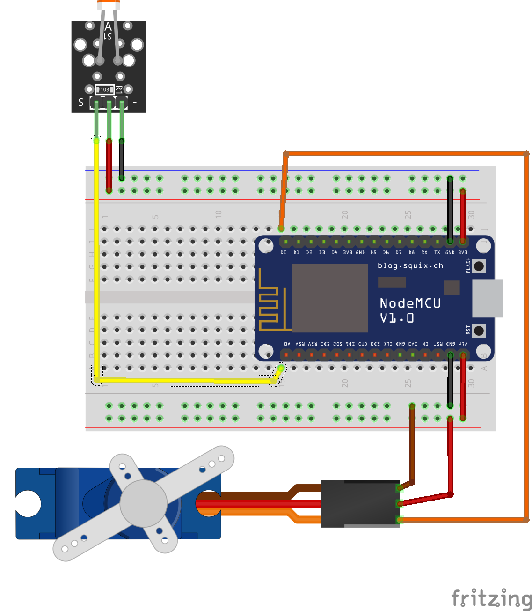

# Chrome Dino Controller
#### Controller for Google Chrome game: Chrome Dino. 
Just for fun.

**Demo Video**

**Device Requirement**
- Chip module base on ESP32 or ESP8266. (NodeMCU or Wemos )
- Photocell module
- Servo

**Software Requirement**
- Downlad & install [Arduino IDE](https://www.arduino.cc/en/Main/Software) 
https://www.arduino.cc/en/Main/Software

- Arduino code for ESP8266 
https://github.com/esp8266/Arduino

**Fritzing wiring diagram**
 

